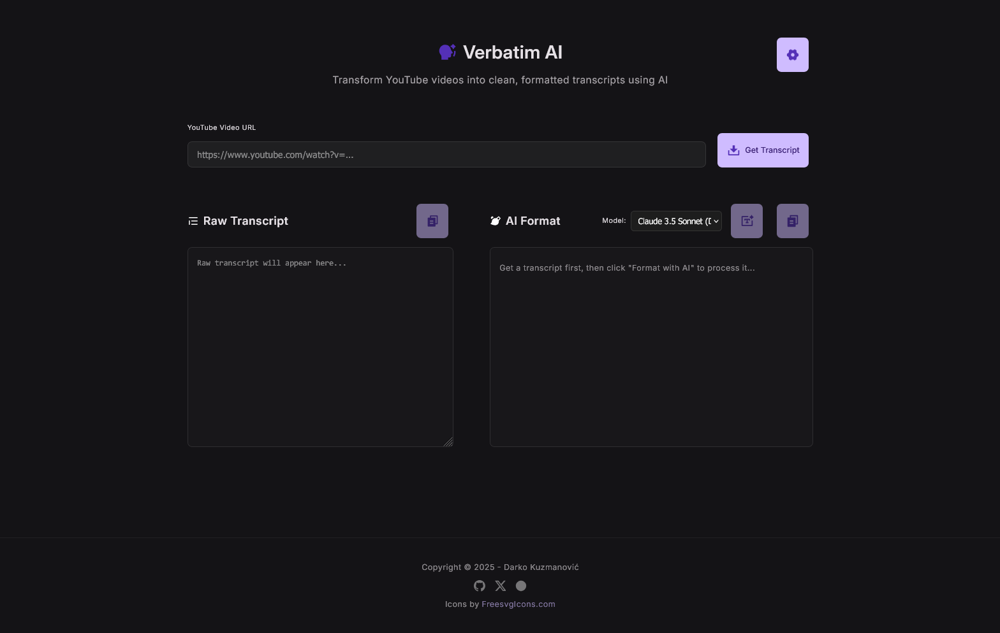

# Verbatim AI

🎥 Extract YouTube transcripts and format them with AI into clean, readable documents. Deployable on any Linux VPS.

<!-- website: https://app.quz.ma/verbatim-ai/ -->



## Features

- 🎥 Extract raw transcripts from YouTube videos
- 🤖 AI-powered formatting with summaries and key topics
- 🌐 Clean, responsive web interface with modern UI
- 📋 Copy-to-clipboard functionality
- ⚙️ Advanced settings with custom API keys and model selection
- 🎨 Dark theme with Material Design components
- 🛡️ Comprehensive error handling
- 🔧 Health check and debugging endpoints
- 💾 Local settings persistence

## Local Development Setup

1. **Install dependencies**:

   ```bash
   pip install -r requirements.txt
   ```

2. **Configure API key**:

   - Copy `.env.example` to `.env`
   - Get your OpenRouter API key from [https://openrouter.ai/keys](https://openrouter.ai/keys)
   - Add your API key to `.env`:

     ```bash
     OPENROUTER_API_KEY=your_actual_api_key_here
     ```

3. **Run the application**:

   **Option A: Production startup (recommended)**:

   ```bash
   python start.py
   ```

   Or run directly:

   ```bash
   uvicorn main:app --host 0.0.0.0 --port 8000 --reload
   ```

   **Option B: Development server**:

   ```bash
   python main.py
   ```

   Or using uvicorn directly:

   ```bash
   uvicorn main:app --host 0.0.0.0 --port 8001 --reload
   ```

4. **Access the application**:
   - Production: Open your browser and go to [http://localhost:8000](http://localhost:8000)
   - Development: Open your browser and go to [http://localhost:8001](http://localhost:8001)

## Deployment

This application is designed for flexible deployment. It can be run at the root of a domain (e.g., `http://example.com`) or under a sub-path (e.g., `http://example.com/verbatim-ai`).

This is controlled by the `BASE_PATH` environment variable.

- **For root deployment**: Set `BASE_PATH=""` in your `.env` file.
- **For sub-path deployment**: Set `BASE_PATH="/your-sub-path"` in your `.env` file.

For detailed instructions on setting up with Nginx, running locally, or deploying on platforms like Vercel, please see the **[Deployment Guide](docs/DEPLOYMENT.md)**.

### Nginx Helper Script

To simplify deployment with Nginx, you can use the `deploy.sh` script to automatically generate a suitable `nginx.conf` file based on your `.env` configuration.

```bash
# Make the script executable
chmod +x deploy.sh

# Run the script to generate generated_nginx.conf
./deploy.sh
```

### Automated Update Script

The `update.sh` script automates the process of pulling the latest changes and restarting the application on a production server.

```bash
# Make the script executable (run once)
chmod +x update.sh

# Run the update script
./update.sh
```

### Automated Repository Description

The repository description in GitHub's "About" section is automatically updated when the README.md file is modified, thanks to the GitHub Actions workflow in `.github/workflows/update-description.yml`.

## Usage

1. Paste a YouTube video URL into the input field
2. Click "Get Transcript" to fetch the raw transcript
3. Click "Format with AI" to process the transcript with AI
4. Use the copy buttons to copy either the raw or formatted transcript

## API Endpoints

### Main Interface

- `GET /` - Main web interface

### API Routes

- `POST /api/transcript` - Fetch YouTube transcript

  ```json
  {
    "youtube_url": "https://www.youtube.com/watch?v=VIDEO_ID"
  }
  ```

- `POST /api/format` - Format transcript with AI

  ```json
  {
    "raw_transcript": "transcript text...",
    "model": "anthropic/claude-3.5-sonnet" // optional
  }
  ```

### Utility Endpoints

- `GET /health` - Health check and configuration status
- `GET /api/test` - Simple test endpoint for debugging

## Error Handling

The application handles various error scenarios:

- Invalid YouTube URLs
- Videos without available transcripts
- API configuration issues
- Network connectivity problems
- Rate limiting and timeouts

## Tech Stack

- **Backend**: FastAPI, Python 3.11
- **Frontend**: HTML5, CSS3, Vanilla JavaScript
- **APIs**: YouTube Transcript API, OpenRouter API
- **AI Model**: Claude 3.5 Sonnet (via OpenRouter)

- **Dependencies**:
  - `fastapi>=0.104.1` - Modern web framework for building APIs
  - `uvicorn>=0.24.0` - ASGI web server for FastAPI
  - `youtube-transcript-api>=0.6.2` - YouTube transcript fetching
  - `httpx>=0.25.2` - HTTP client for API calls
  - `python-multipart>=0.0.6` - Multipart form data handling
  - `python-dotenv>=1.0.0` - Environment variable management
  - `mangum>=0.17.0` - AWS Lambda adapter for FastAPI
  - `asgiref>=3.7.2` - ASGI utilities

## Project Structure

```tree
├── api/
│   └── index.py          # FastAPI app entry point for Vercel
├── docs/
│   └── DEPLOYMENT.md     # Detailed deployment guide
├── utils/
│   ├── youtube.py        # YouTube transcript fetching
│   └── llm.py            # AI formatting logic
├── static/               # Static files (HTML, CSS, JS)
│   ├── index.html        # Main web interface
│   ├── script.js         # Frontend JavaScript
│   ├── beer-layout.css   # Custom CSS styles
│   └── icons/            # UI icons
├── config.py             # Configuration management
├── main.py               # Development server (port 8001)
├── start.py              # Production startup script (port 8000)
├── requirements.txt      # Python dependencies
├── .env.example          # Environment variables template
├── deploy.sh             # Deployment helper script (e.g., for Nginx)
├── update.sh             # Automated server update script
└── README.md             # This file
```

## Environment Variables

| Variable                | Description                                | Required              |
| ----------------------- | ------------------------------------------ | --------------------- |
| `OPENROUTER_API_KEY`    | Your OpenRouter API key                    | Yes                   |
| `BASE_PATH`             | Deployment sub-path (e.g., `/verbatim-ai`) | No (defaults to `""`) |
| `OPENROUTER_BASE_URL`   | OpenRouter API base URL                    | No (has default)      |
| `DEFAULT_MODEL`         | Default AI model to use                    | No (has default)      |
| `MAX_TRANSCRIPT_LENGTH` | Maximum transcript length                  | No (has default)      |
| `REQUEST_TIMEOUT`       | API request timeout in seconds             | No (has default)      |
